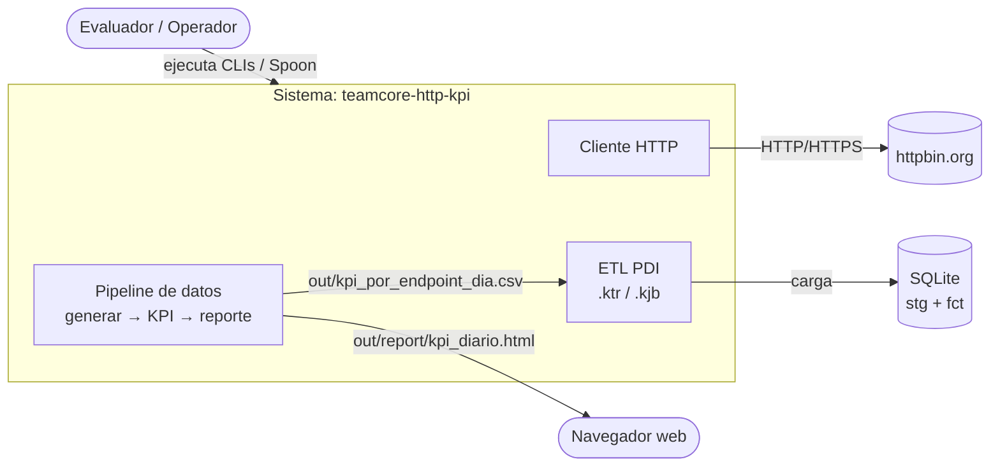
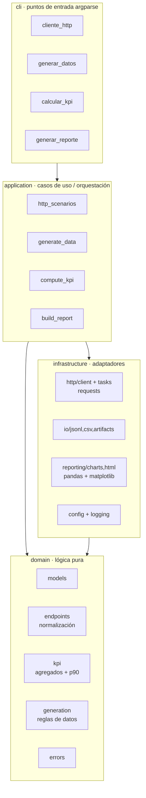

# Visión de Arquitectura

> Estado: Aprobado · Decisiones asociadas: [ADR-0003](../adr/0003-pragmatic-layered-architecture.md),
> [ADR-0004](../adr/0004-http-requests-over-browser-automation.md)

## 1. Principios rectores

1. **Dominio en el centro.** La lógica de negocio (normalización de endpoints,
   cálculo de KPIs, percentiles, reglas de generación) es **pura**: sin red,
   sin ficheros, sin `argparse`. Es lo más valioso y lo más testeable.
2. **Dependencias hacia adentro.** `cli → application → domain` y
   `infrastructure → domain`. El dominio no importa nada de las capas externas
   (Regla de Dependencia).
3. **Puertos y adaptadores donde aporta valor.** Se definen interfaces (puertos)
   solo cuando hay una frontera real de E/S (HTTP, ficheros). No se abstrae por
   abstraer (YAGNI).
4. **Composición en los bordes.** Las CLIs son el *composition root*: construyen
   las dependencias concretas y las inyectan en los casos de uso.
5. **Simplicidad deliberada.** Arquitectura por capas pragmática, no Clean
   Architecture ceremoniosa. Ver [ADR-0003](../adr/0003-pragmatic-layered-architecture.md).

## 2. Vista de contexto (C4 nivel 1)

El sistema tiene dos flujos: el **cliente HTTP** (Parte 0) y el **pipeline de datos**
(Partes 1, 2 y 3). El ETL de PDI (Parte 2) consume el **CSV de KPIs** y carga a
SQLite; se autora como XML de PDI y se valida funcionalmente en una instalación de
Spoon/Kitchen (ver [ADR-0013](../adr/0013-pentaho-pdi-in-scope.md)).

## 3. Vista de capas (C4 nivel 2/3)

**Regla de dependencia (invariante arquitectónico):** ninguna flecha entra a
`domain`. Se verifica en revisión y, opcionalmente, con una prueba de arquitectura
que falla si `domain` importa `requests`, `pandas`, `matplotlib`, `argparse`, etc.

## 4. Responsabilidades por capa

| Capa | Responsabilidad | Conoce | NO conoce |
|---|---|---|---|
| `domain` | Reglas de negocio puras y modelos | stdlib, `numpy` (cálculo) | red, ficheros, CLI, pandas, matplotlib |
| `application` | Orquestar casos de uso; coordinar puertos | `domain` + puertos | detalles de `requests`/`pandas` |
| `infrastructure` | Implementar puertos: HTTP, E/S, gráficos, config, logging | librerías externas | reglas de negocio |
| `cli` | Parsear argumentos, componer dependencias, códigos de salida | `application` + config | reglas de negocio |

> Nota sobre `numpy` en `domain`: el enunciado exige `numpy.percentile` para el
> p90. Se admite `numpy` como dependencia de cálculo del dominio (no de E/S),
> manteniendo el dominio libre de efectos secundarios. Ver
> [ADR-0009](../adr/0009-data-contracts-and-formats.md).

## 5. Patrones aplicados

- **Ports & Adapters (Hexagonal, pragmático):** `HttpPort`, `BitacoraRepository`,
  `KpiRepository`, `ChartRenderer` como interfaces; adaptadores concretos en
  `infrastructure`.
- **Dependency Injection manual:** las CLIs inyectan adaptadores; no se usa un
  framework de DI (YAGNI).
- **Strategy** (implícito) para la política de reintentos del cliente HTTP.
- **Pipeline** para el flujo generar → KPI → reporte (cada etapa lee la salida de
  la anterior a través de contratos de fichero).

## 6. Atributos de calidad y cómo los soporta la arquitectura

| Atributo | Mecanismo arquitectónico |
|---|---|
| Testabilidad | Dominio puro + puertos ⇒ pruebas sin red/ficheros |
| Mantenibilidad | Capas y responsabilidades únicas (SRP) |
| Reutilización | Lógica en `domain`, reutilizable por cualquier CLI/servicio |
| Escalabilidad | Cálculo vectorizado (`numpy`/`pandas`); etapas desacopladas por ficheros |
| Extensibilidad | Nuevos adaptadores (p. ej. Selenium) implementan un puerto existente sin tocar dominio |
| Simplicidad | Sin framework de DI, sin capas superfluas |

## 7. Puntos de extensión conocidos

- **Renderizado con navegador:** si en el futuro un endpoint requiriera JS, se
  añadiría un `SeleniumHttpAdapter` que implementa `HttpPort`, sin cambiar
  `application`/`domain` (ver [ADR-0004](../adr/0004-http-requests-over-browser-automation.md)).
- **Otros formatos de KPI:** un nuevo `ParquetKpiRepository` implementaría
  `KpiRepository` sin afectar el cálculo.
- **Nuevos KPIs:** se agregan como funciones puras en `domain/kpi.py` con su
  prueba, y se exponen en el contrato del CSV (versionado).
