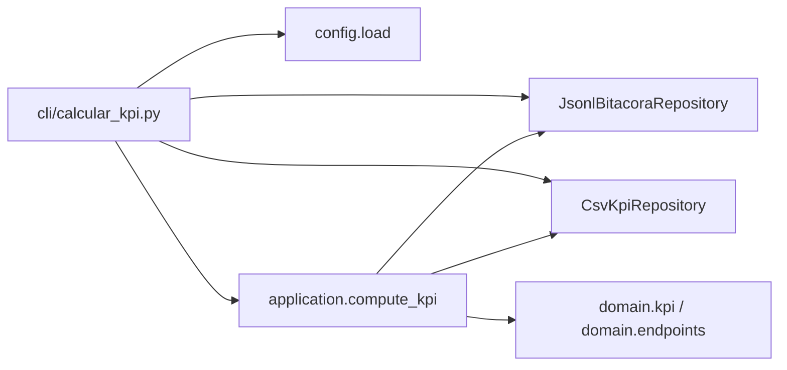

# Modelo de Componentes (Puertos y Adaptadores)

> Estado: Aprobado. Define las interfaces (puertos) y sus implementaciones
> (adaptadores). Las firmas son *contratos de diseño*; la implementación vive en
> la fase de desarrollo.

## 1. Puertos (interfaces en `application/ports.py`)

Los puertos se definen con `typing.Protocol` (tipado estructural, sin herencia
forzada) para máxima testabilidad y desacoplamiento.

### `HttpPort`
Abstracción mínima de un cliente HTTP con sesión y reintentos.

```python
class HttpResponse(Protocol):
    status_code: int
    text: str
    def json(self) -> Any: ...
    @property
    def headers(self) -> Mapping[str, str]: ...
    @property
    def history(self) -> Sequence["HttpResponse"]: ...

class HttpPort(Protocol):
    def get(self, path: str, *, auth: tuple[str, str] | None = None,
            allow_redirects: bool = True) -> HttpResponse: ...
    def post(self, path: str, *, data: Mapping[str, str]) -> HttpResponse: ...
```

### `BitacoraRepository`
Persistencia de la bitácora (`datos.jsonl`).

```python
class BitacoraRepository(Protocol):
    def write(self, records: Iterable[BitacoraRecord], destination: Path) -> int: ...
    def read(self, source: Path) -> Iterator[BitacoraRecord]: ...
```

### `KpiRepository`
Persistencia del CSV de KPIs (contrato con Pentaho).

```python
class KpiRepository(Protocol):
    def write(self, rows: Sequence[KpiRow], destination: Path) -> None: ...
    def read(self, source: Path) -> list[KpiRow]: ...
```

### `ArtifactWriter`
Escritura de los artefactos del cliente HTTP.

```python
class ArtifactWriter(Protocol):
    def write_json(self, payload: Any, destination: Path) -> None: ...
    def write_xml(self, xml_bytes: bytes, destination: Path) -> None: ...
    def write_text(self, text: str, destination: Path) -> None: ...
```

### `ChartRenderer` / `ReportRenderer`

```python
class ChartRenderer(Protocol):
    def bar_requests_by_endpoint(self, rows: Sequence[KpiRow]) -> bytes: ...   # PNG
    def p90_by_endpoint(self, rows: Sequence[KpiRow]) -> bytes: ...            # PNG

class ReportRenderer(Protocol):
    def render(self, metrics: GlobalMetrics, rows: Sequence[KpiRow],
               charts: Mapping[str, bytes], umbral_p90: float) -> str: ...     # HTML
```

## 2. Adaptadores (en `infrastructure/`)

| Puerto | Adaptador | Tecnología | Requisitos |
|---|---|---|---|
| `HttpPort` | `RequestsHttpClient` | `requests.Session` + backoff | FR-01…FR-08, FR-03 (retries) |
| `BitacoraRepository` | `JsonlBitacoraRepository` | `json` + stream de líneas | FR-09, FR-11 |
| `KpiRepository` | `CsvKpiRepository` | `csv` (escritura), `pandas` (lectura en reporte) | FR-10, FR-13 |
| `ArtifactWriter` | `FileSystemArtifactWriter` | `pathlib`, `lxml`/`bs4` | FR-04, FR-05, FR-06 |
| `ChartRenderer` | `MatplotlibChartRenderer` | `matplotlib` (Agg) | FR-13 |
| `ReportRenderer` | `HtmlReportRenderer` | plantilla + PNG base64 embebido | FR-13 |

> **Sustituibilidad:** cualquier adaptador puede reemplazarse (p. ej. un
> `SeleniumHttpClient` para `HttpPort`) sin tocar `application`/`domain`.

## 3. Componentes de dominio (sin puerto; son lógica pura)

| Componente | Función | Requisito | Doc de reglas |
|---|---|---|---|
| `domain/endpoints.py` | `normalize_endpoint(path) -> str` | FR-10 | [normalización](../contracts/data-contracts.md#normalización-de-endpoints) |
| `domain/kpi.py` | `aggregate(records) -> list[KpiRow]`, `percentile_90(values)` | FR-10 | [KPIs](../contracts/data-contracts.md#kpis) |
| `domain/generation.py` | `generate_records(n, seed, ref_utc) -> Iterator[BitacoraRecord]` | FR-09 | [SPEC-002](../specs/SPEC-002-generar-datos.md) |
| `domain/models.py` | dataclasses inmutables tipadas | todos | [contratos](../contracts/data-contracts.md) |
| `domain/errors.py` | jerarquía de excepciones | FR-11, NFR-03 | [ADR-0007](../adr/0007-error-handling-retries-idempotency.md) |

## 4. Composición (composition root)

Cada CLI construye el grafo de dependencias y lo inyecta:



No hay contenedor de DI: la construcción explícita en `main()` es suficiente y más
legible (KISS). Las pruebas inyectan dobles directamente.

## 5. Jerarquía de errores (resumen)

```
TeamcoreError                     (base del proyecto)
├── ConfigError                   (config inválida — fail fast)
├── HttpTaskError                 (fallo en un escenario HTTP)
│   └── AccessForbiddenError      (403 tras agotar reintentos)
├── DataInputError                (E/S de entrada)
│   ├── InputFileNotFoundError
│   └── MalformedRecordError      (línea JSONL inválida)
└── ReportError                   (fallo al construir el reporte)
```

Detalle de semántica y políticas en
[ADR-0007](../adr/0007-error-handling-retries-idempotency.md).
