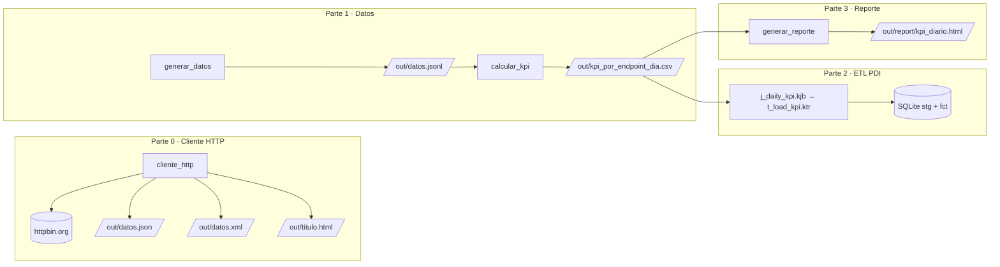
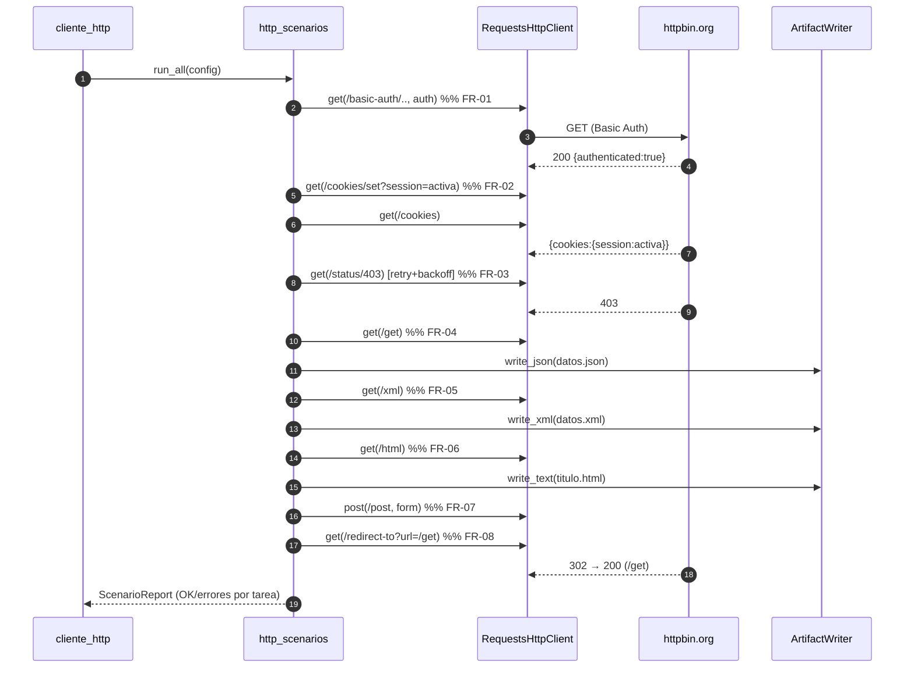
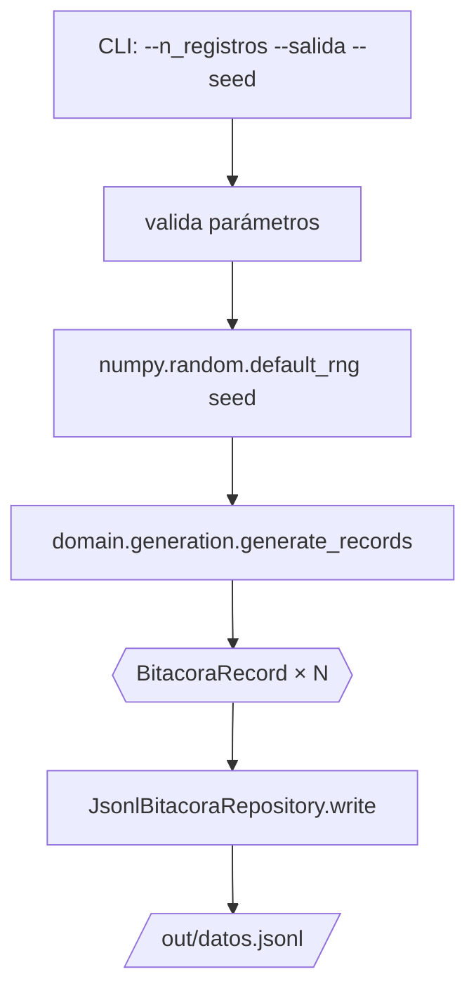
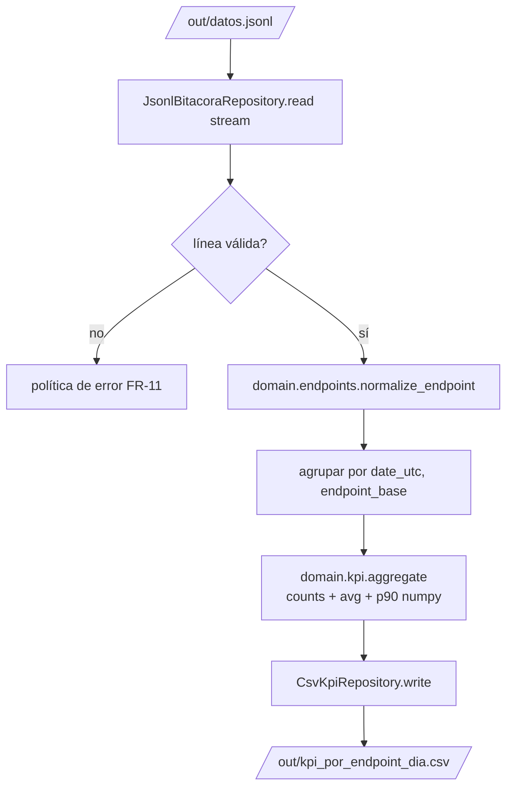
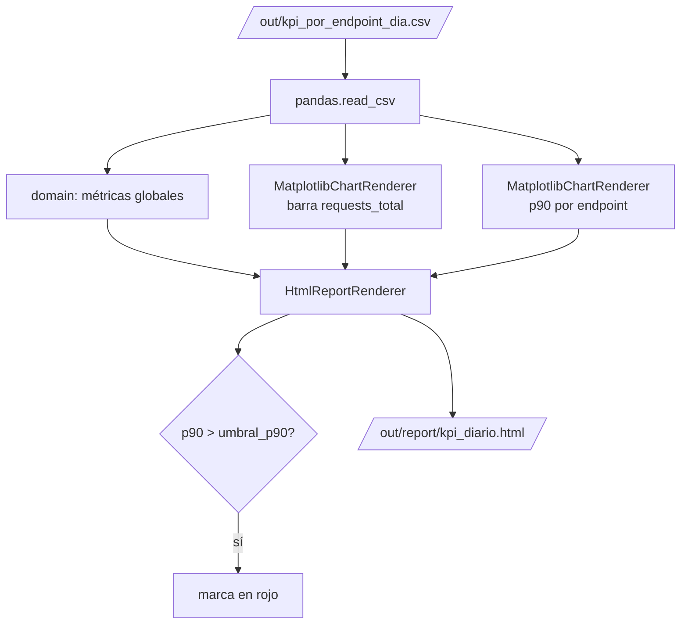
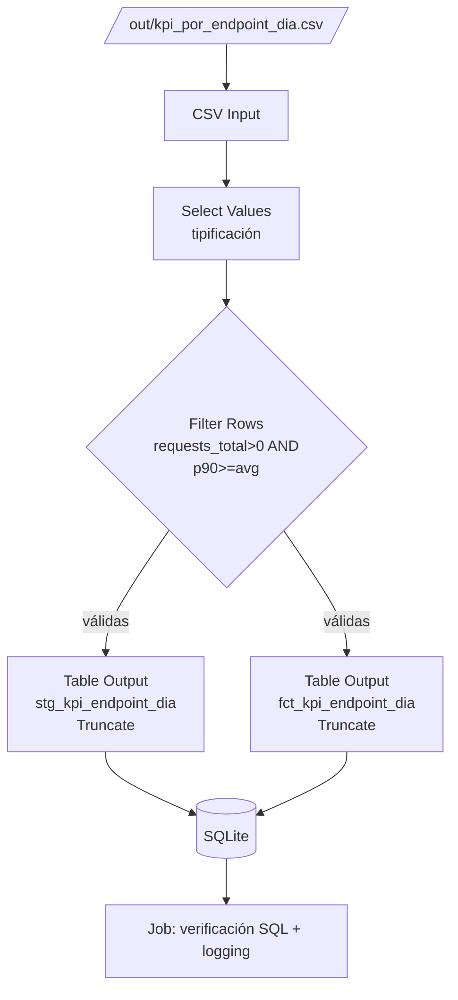

# Flujo de Ejecución y de Datos

> Estado: Aprobado. Describe cómo fluyen los datos entre componentes y artefactos.

## 1. Vista general del pipeline

Las cuatro partes son **independientes y encadenables por ficheros**. El acoplamiento
es por *contrato de datos*, no por código: cada etapa lee la salida de la anterior.
El CSV de KPIs alimenta tanto al reporte (Parte 3) como al ETL de PDI (Parte 2).

## 2. Cliente HTTP — secuencia de los 6 escenarios (FR-01…FR-08)

**Notas de diseño**
- Una **única `requests.Session`** se comparte entre escenarios ⇒ FR-02 (cookies)
  funciona de forma natural.
- La política de reintentos (FR-03) vive en el cliente y aplica a errores
  transitorios y a `403` de forma configurable.
- Cada escenario es independiente: un fallo se registra y **no aborta** los demás
  (se reporta un resumen final con estado por tarea).

## 3. Generación de datos (FR-09)

Determinismo: la `seed` fija todas las decisiones aleatorias ⇒ NFR-07. El ancla
temporal es `datetime.now(UTC)` en ejecución real; en pruebas se inyecta un `ref_utc`
fijo a la función de dominio (no es un flag de CLI) para lograr salidas idénticas.

## 4. Cálculo de KPIs (FR-10)

- `date_utc` = fecha (YYYY-MM-DD) derivada de `timestamp_utc`.
- `endpoint_base` = normalización (`/status/403` → `/status`).
- `p90_elapsed_ms` = `numpy.percentile(elapsed, 90)` por grupo.

## 5. Reporte HTML (FR-13)

Los gráficos se generan con backend `Agg` (sin display) y se **embeben** en el HTML
como PNG en base64 ⇒ un único fichero autocontenido, portable y versionable.

## 6. ETL con PDI (FR-14…FR-17)

Orquestado por `j_daily_kpi.kjb`. Cargas con *Truncate* ⇒ idempotencia. Detalle en
[SPEC-005](../specs/SPEC-005-etl-pdi.md).

## 7. Contrato entre etapas

| Productor | Artefacto | Consumidor | Contrato |
|---|---|---|---|
| `generar_datos` | `out/datos.jsonl` | `calcular_kpi` | [esquema JSONL](../contracts/data-contracts.md#bitácora-datosjsonl) |
| `calcular_kpi` | `out/kpi_por_endpoint_dia.csv` | `generar_reporte` **y ETL PDI** | [contrato CSV](../contracts/data-contracts.md#kpi-csv) |
| `t_load_kpi.ktr` | SQLite `stg_*` / `fct_*` | Consultas del usuario | [modelo SQLite](../contracts/data-contracts.md#modelo-relacional-sqlite-pdi) |
| `cliente_http` | `datos.json`/`datos.xml`/`titulo.html` | Evaluador | [artefactos HTTP](../contracts/data-contracts.md#artefactos-del-cliente-http) |
