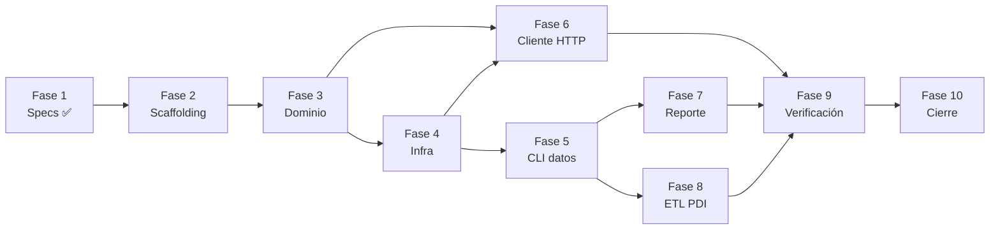

# Plan de Fases y Entregables

> Metodología: SDD. Cada fase produce entregables verificables y no comienza hasta
> que la anterior cumple su *Definition of Done* (DoD).

## Definition of Done (global)

Una unidad de trabajo está *hecha* cuando:
1. Tiene spec aprobada y está en la [RTM](../requirements/requirements-traceability-matrix.md).
2. Tiene pruebas verdes que cubren sus criterios de aceptación.
3. `ruff check` y `mypy --strict` pasan sin errores.
4. La documentación afectada está actualizada.
5. La trazabilidad (RTM) refleja el nuevo estado.
6. **No** se ejecutó ninguna operación Git sin autorización explícita.

## Fases

### Fase 0 — Inception y análisis ✅ (completada)
- **Entregables:** análisis del documento fuente, alcance/fuera de alcance, charter.
- **DoD:** [project-charter.md](../project-charter.md) aprobado.

### Fase 1 — Especificación ✅ (completada, fase actual)
- **Entregables:** requisitos (FR/NFR) + RTM, arquitectura + diagramas, 13 ADRs,
  contratos de datos, SPEC-001…004, estrategia de pruebas, casos de uso, runbook,
  `CLAUDE.md`, scaffolding de proyecto (`pyproject.toml`, `Makefile`).
- **DoD:** 100 % de requisitos especificados y trazados; specs en estado *Aprobado*.
- **Puerta de entrada a implementación:** requiere **visto bueno explícito** del
  usuario antes de escribir código de producción.

### Fase 2 — Scaffolding del paquete
- **Entregables:** árbol `src/teamcore_http_kpi/` con módulos vacíos tipados,
  `config.py`, `logging_config.py`, `conftest.py`, shims raíz, prueba de arquitectura
  (dominio sin deps externas).
- **Requisitos:** NFR-01/09/10/14.
- **DoD:** `make check` en verde sobre el esqueleto (sin lógica todavía).

### Fase 3 — Dominio (TDD)
- **Entregables:** `domain/models.py`, `endpoints.py`, `kpi.py`, `generation.py`,
  `errors.py` con pruebas unitarias.
- **Requisitos:** FR-09, FR-10 (núcleo), NFR-05/07.
- **DoD:** cobertura de dominio ≥ 90 %; normalización y p90 documentados y probados.

### Fase 4 — Infraestructura (adaptadores)
- **Entregables:** `io/` (jsonl, csv, artifacts), `http/client.py`, `reporting/`.
- **Requisitos:** FR-04/05/06, FR-11, NFR-08/13.
- **DoD:** pruebas de integración verdes (E/S en `tmp_path`, HTTP con `responses`).

### Fase 5 — Aplicación y CLI (datos)
- **Entregables:** `application/generate_data.py`, `compute_kpi.py`; CLIs
  `generar_datos.py`, `calcular_kpi.py`.
- **Requisitos:** FR-09, FR-10, FR-11.
- **DoD:** e2e con golden files; comandos del enunciado funcionan literalmente.

### Fase 6 — Cliente HTTP (Parte 0)
- **Entregables:** `http/tasks.py`, `application/http_scenarios.py`, CLI
  `cliente_http.py`.
- **Requisitos:** FR-01…FR-08.
- **DoD:** pruebas de los 6 escenarios con dobles; artefactos correctos; humo
  opcional `@network`.

### Fase 7 — Reporte (Parte 3)
- **Entregables:** `application/build_report.py`, `reporting/charts.py`,
  `html_report.py`, CLI `generar_reporte.py`.
- **Requisitos:** FR-13.
- **DoD:** e2e que valida secciones, alerta por umbral y HTML autocontenido.

### Fase 8 — ETL con Pentaho/PDI (Parte 2)
- **Entregables:** `etl_pdi/t_load_kpi.ktr`, `etl_pdi/j_daily_kpi.kjb`,
  `sql/ddl.sql`, `config/kettle.properties.example`, `etl_pdi/README.md`.
- **Requisitos:** FR-14…FR-17.
- **DoD:** validación estructural de los XML (pasos y referencias correctas); DDL
  válido; runbook de ejecución. Validación funcional a cargo del usuario en PDI.

### Fase 9 — Verificación y endurecimiento
- **Entregables:** pruebas de idempotencia/determinismo/volumen; ajuste de logging y
  errores; revisión de cobertura y gates.
- **Requisitos:** NFR-03/07/08/13.
- **DoD:** todos los gates de [test-strategy.md](../testing/test-strategy.md) en verde.

### Fase 10 — Cierre documental y handoff
- **Entregables:** README final con ejemplos ejecutados, `CHANGELOG`, verificación de
  la RTM (todo trazado), nota de handoff del contrato CSV para la parte PDI.
- **Requisitos:** FR-12.
- **DoD:** repositorio listo para revisión senior; RTM 100 % verificada.

## Cronograma lógico (dependencias)

## Entregables por parte del enunciado

| Parte | Entregable | Fase | Estado |
|---|---|---|---|
| 0 | `datos.json`, `datos.xml`, `titulo.html` | 6 | Pendiente |
| 1.1 | `generar_datos.py` → `datos.jsonl` | 5 | Pendiente |
| 1.2 | `calcular_kpi.py` → `kpi_por_endpoint_dia.csv` | 5 | Pendiente |
| 2 (PDI) | `t_load_kpi.ktr`, `j_daily_kpi.kjb`, SQLite | 8 | Pendiente |
| 3 | `generar_reporte.py` → `kpi_diario.html` | 7 | Pendiente |
