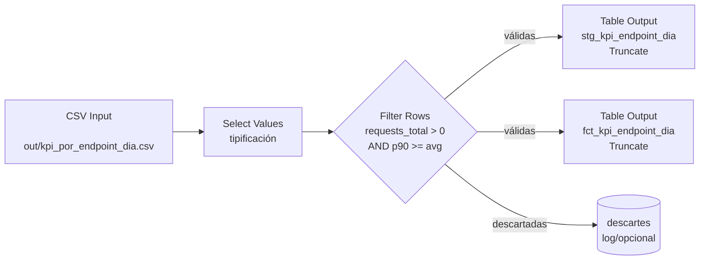
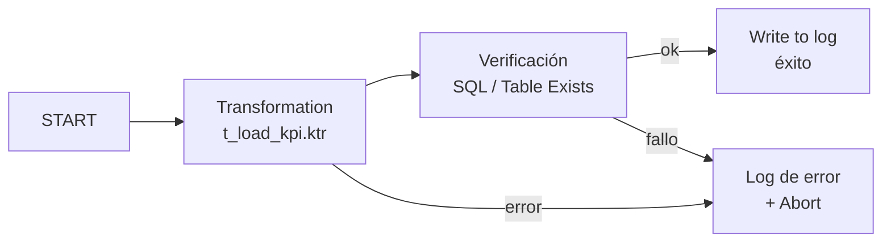

# SPEC-005 · ETL con Pentaho Data Integration (`etl_pdi/`)

- **ID:** SPEC-005
- **Estado:** Aprobado
- **Requisitos cubiertos:** FR-14, FR-15, FR-16, FR-17
- **Contratos:** [KPI CSV](../contracts/data-contracts.md#kpi-csv),
  [tablas SQLite](../contracts/data-contracts.md#modelo-relacional-sqlite-pdi)
- **Decisiones:** [ADR-0013](../adr/0013-pentaho-pdi-in-scope.md)

## 1. Objetivo

Cargar el CSV de KPIs a una base **SQLite** mediante una transformación (`.ktr`) y un
job (`.kjb`) de PDI, con tipificación, validación, staging + fact idempotentes y
verificación posterior con logging. Reproduce fielmente la Sección 2 del enunciado.

> **Restricción de validación:** los ficheros se autoran como XML de PDI y se
> entregan estructuralmente correctos. La ejecución real (Spoon/Kitchen) y su
> verificación se realizan en la instalación de PDI del usuario
> ([ADR-0013](../adr/0013-pentaho-pdi-in-scope.md)).

## 2. Entradas y salidas

- **Entrada:** `out/kpi_por_endpoint_dia.csv` (contrato v1.0).
- **Salida:** base SQLite (p. ej. `etl_pdi/db/kpi.sqlite`) con tablas
  `stg_kpi_endpoint_dia` y `fct_kpi_endpoint_dia`; log de ejecución.
- **Artefactos versionados en `etl_pdi/`:**
  - `t_load_kpi.ktr`, `j_daily_kpi.kjb`
  - `sql/ddl.sql` (DDL de staging y fact)
  - `config/kettle.properties.example` (conexión/rutas, sin secretos)
  - `README.md` (abrir en Spoon, ejecutar con Kitchen/Pan)

## 3. Comportamiento

### FR-14 · Transformación `t_load_kpi.ktr`
Flujo de pasos (fiel al enunciado 2.1):



1. **CSV Input:** lee el CSV con encabezado, delimitador `,`, UTF-8.
2. **Tipificación (Select Values / Metadata):** `date_utc`→Date (`yyyy-MM-dd`),
   `endpoint_base`→String, conteos→Integer, `avg_elapsed_ms`/`p90_elapsed_ms`→Number.
3. **Filter Rows (validación/sanidad):** conserva filas con `requests_total > 0`
   **y** `p90_elapsed_ms >= avg_elapsed_ms`; descarta el resto.
4. **Table Output → `stg_kpi_endpoint_dia`:** staging sin transformaciones, con
   *Truncate table* (idempotencia).
5. **Table Output → `fct_kpi_endpoint_dia`:** copia directa del mismo flujo filtrado,
   con *Truncate table* (idempotencia).

### FR-15 · Job `j_daily_kpi.kjb`
Flujo (fiel al enunciado 2.2):



1. Ejecuta `t_load_kpi.ktr`.
2. **Verificación posterior:** paso «Table Exists» y/o «SQL» que comprueba que el
   número de filas cargadas coincide con la suma de `success_2xx + client_4xx +
   server_5xx` (según enunciado 2.2.2 — ver [nota de interpretación](#5-nota-de-interpretación)).
3. **Logging:** registra en un log (fichero o tabla `etl_log`) el resultado de la
   carga y cualquier error.

### FR-16 · Persistencia e idempotencia
Ambas tablas se cargan con *Truncate*, de modo que reejecutar el job deja la BD en el
mismo estado (idempotencia). DDL en `sql/ddl.sql`.

### FR-17 · Configuración y credenciales separadas
La conexión (ruta del fichero SQLite u otras credenciales) se define en
`config/kettle.properties.example` y se documenta aparte; sin secretos en git.

## 4. Modelo relacional (resumen)

Columnas espejo del CSV (ver [contrato SQLite](../contracts/data-contracts.md#modelo-relacional-sqlite-pdi)):
`date_utc`, `endpoint_base`, `requests_total`, `success_2xx`, `client_4xx`,
`server_5xx`, `parse_errors`, `avg_elapsed_ms`, `p90_elapsed_ms`.

## 5. Nota de interpretación

El enunciado 2.2.2 pide verificar que «el número de filas cargadas coincide con la
suma de `success_2xx`, `client_4xx` y `server_5xx`». Literalmente, el número de filas
= número de grupos `(date_utc, endpoint_base)`, mientras que esa suma = total de
solicitudes clasificadas; ambos coinciden solo si hubiera una solicitud por grupo. Se
implementa la verificación **tal como la describe el enunciado** (consulta SQL
explícita); el matiz queda documentado aquí. Una verificación de integridad
alternativa (p. ej. `SUM(requests_total)` esperado vs. cargado) queda como
opción futura si se decide revisar este criterio.

## 6. Criterios de aceptación

Al no ejecutarse PDI en este entorno, la aceptación se define en dos niveles:

**Estructural (verificable aquí):**
```gherkin
Feature: Artefactos PDI presentes y bien formados (FR-14..FR-17)
  Scenario: Transformación
    Then existe etl_pdi/t_load_kpi.ktr con pasos CSV Input, tipificación,
         Filter Rows y dos Table Output (stg y fct) con Truncate
  Scenario: Job
    Then existe etl_pdi/j_daily_kpi.kjb que ejecuta la transformación,
         verifica la carga y registra el resultado
  Scenario: Soporte
    Then existen sql/ddl.sql, config/kettle.properties.example y README.md
```

**Funcional (verificable por el usuario en Spoon/Kitchen):**
```gherkin
Feature: Carga correcta a SQLite
  Scenario: Ejecución del job
    Given un CSV de KPIs válido en out/
    When el usuario ejecuta j_daily_kpi.kjb en su PDI
    Then stg_kpi_endpoint_dia y fct_kpi_endpoint_dia contienen las filas válidas
    And reejecutar el job produce el mismo estado (Truncate)
    And el log registra el resultado de la verificación
```

## 7. Trazabilidad

FR-14..FR-17 → [RTM](../requirements/requirements-traceability-matrix.md).
